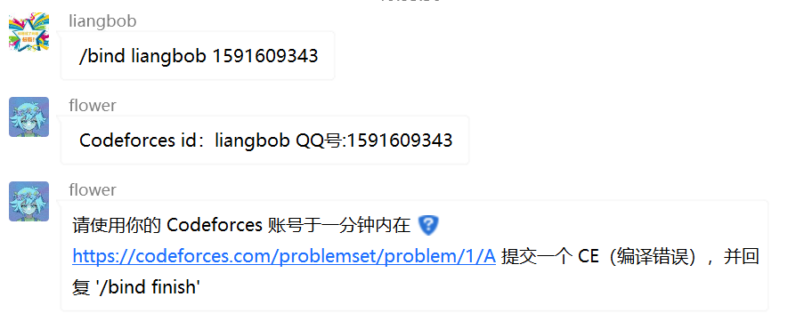

# CP_Bot

## description

这是一个用于算法竞赛的 QQ 聊天 bot 。

## 技术栈

[主页 | GraiaX 文档](https://graiax.cn/)

[Mirai API HTTP 安装 - Graia 官方文档](https://graia.readthedocs.io/ariadne/appendix/mah-install/)

[GraiaProject/Ariadne: 一个优雅且完备的 Python QQ 自动化框架，基于 Mirai API HTTP v2。 Powered by Graia Project. (github.com)](https://github.com/GraiaProject/Ariadne)


## 功能设计 []表示必填 {}表示选填

### /fun

* /fun 天气 [国内城市名]                                         -> 返回今日天气
* /fun 签到                                                                -> 签到，并返回今日人品

### /bind

* /bind  [用户名]                                  			         -> 一个qq号绑定一个用户名 
* /bind cf [CF_id]                                   		           -> 绑定cf账号，一个qq号绑定一个cf号 [前置：绑定用户名]

* * 绑定方法如下[不需要输入qq号]

 

* /bind cf [CF_id]                                   		           -> 绑定atc账号，一个qq号绑定一个atc号 [前置：绑定用户名]

### /oj 

* /cf                                                                            -> 返回最近三场cf比赛时间
* /atc                                                                           -> 返回最近三场atc比赛时间
* /nc                                                                            -> 返回最近三场牛客比赛时间

* /cf rand [div4/div3/div2/div1/Edu]                     ->返回随机对应比赛
* /cf rand [rating]                                                     ->返回随机对应分数题目
* /cf info [cfid]                                                           ->返回cfid的info [cfid,curRaing ,maxRating,称号]

* /cf allinfo                                                                 ->返回本群的成员的cfid，分数列表
* /atc rand [abc/arc/agc]                                         ->返回随机对应比赛
* /atc rand [abc/arc/agc] [a/b/c/d/e/f/g/h]          ->返回对应类型对应题目标号


### /subscribe

* /sub 天气 [国内城市名]                                         -> 每日已订阅城市列表的天气
* /sub cp                                                                   -> 每日早八提醒今日的cf/atc/牛客，赛前十五分钟提醒。


### /pk [多人做题，上限4人，下限2人]

* /pk create [rating] [password]：房主创房，将随机选取一道cf分数为 rating 的题目 , pk 密码 
* /pk atccreate [abc/arc/agc] [a,b,c,d,e,f] [password]：房主创房，将随机选取一道 atcoder 的对应题目 ，pk密码
* /pk join [password] : 加入 pk密码为password的比赛
* /pk start ：房主开趴，公布题目连接。
* /pk ongoing: 查询正在进行的趴。
* /pk query @p：查询用户 p 的 ELO rating
* /pk ranklist: 查询本群排行榜
* /pk history @p 查询用户 p 的参趴历史


### /info 

* /info me ： 查看 我的信息 [我的用户名，qq号]
* /info @p ：查看 qq号为p 的所有信息


#### ELO  积分计算

```python
from collections import namedtuple

Player = namedtuple("Player", ["name", "rating", "num_games"])


def update_ratings(players, rankings):
    def expected_score(rating_diff):
        return 1 / (1 + 10 ** (rating_diff / 400))

    def dynamic_K(num_games):
        return 1 + 400 / (30 + num_games)

    num_players = len(players)
    rating_changes = [0] * num_players

    for i in range(num_players):
        for j in range(num_players):
            if i == j:
                continue

            result_i = 1 if rankings[i] < rankings[j] else 0.5 if rankings[i] == rankings[j] else 0

            expected_i = expected_score(players[j].rating - players[i].rating)
            K_i = dynamic_K(players[i].num_games)

            rating_changes[i] += K_i * (result_i - expected_i)

    updated_players = []
    for player, rating_change in zip(players, rating_changes):
        updated_players.append(Player(player.name, player.rating + rating_change, player.num_games + 1))

    return updated_players

```

